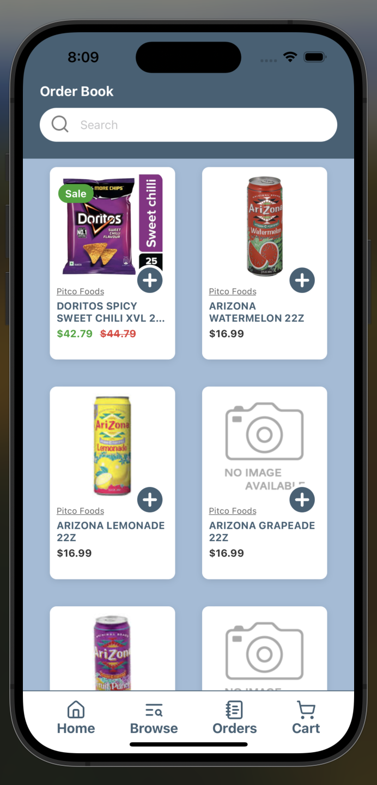

# simple-order-book



## Description

This is a mock "order book" app built with React Native. It's a simple app that displays a list of items and allows you to search for items and add them to an order.

See Spec for more details: https://join-attain.notion.site/Attain-Founding-Engineer-Take-Home-145a9f2b7e3880a89f0beae9ebfec160

## Features

- Display a list of items
- Search for items
- Add items to an order

## Getting Started

1. Clone the repository
2. Navigate to the project directory
```
cd order-book
```
3. Install dependencies
```
npm install
```
4. Start the app on your device or emulator of choice
> NOTE: You may need to install the Xcode simulator to run the app on MacOS.

```
// ios example
npm run ios
```

